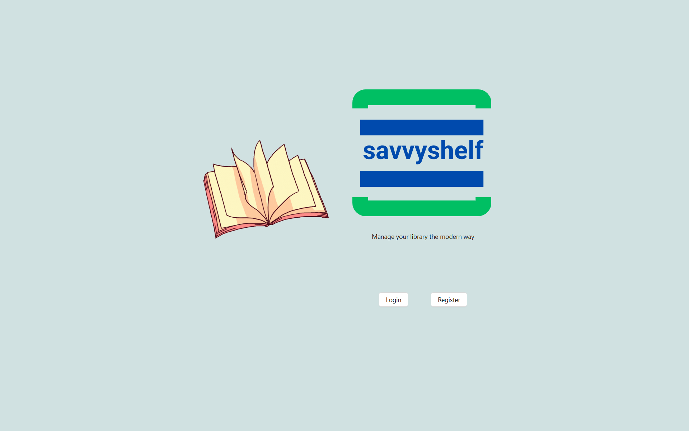
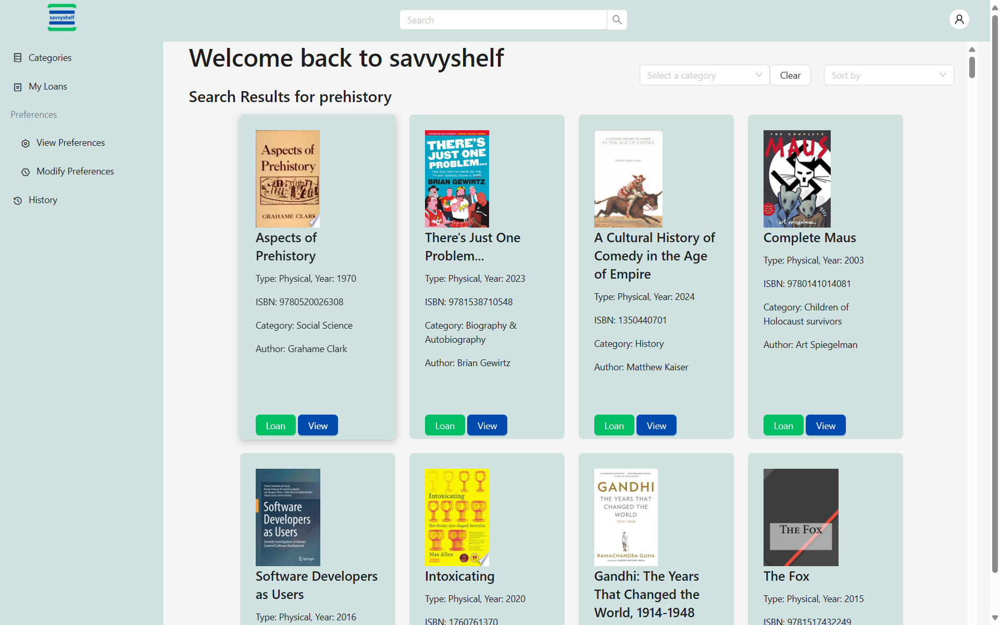
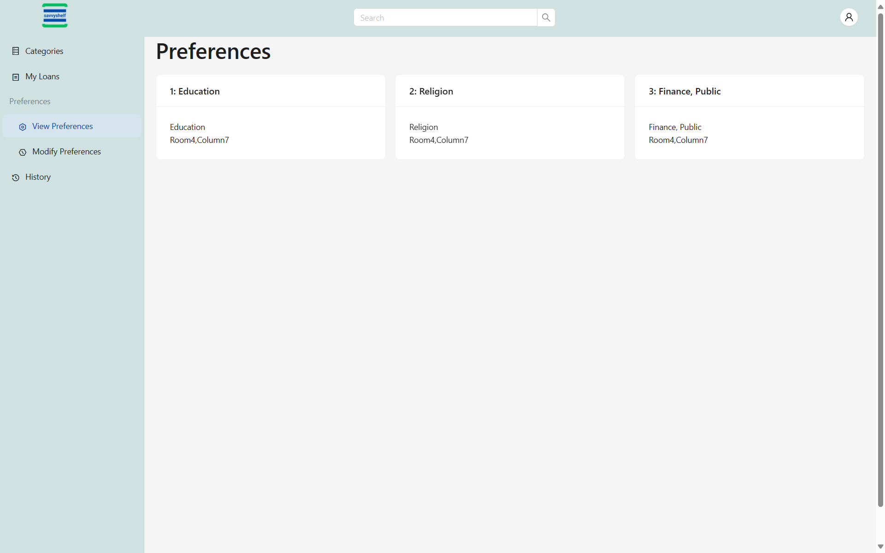
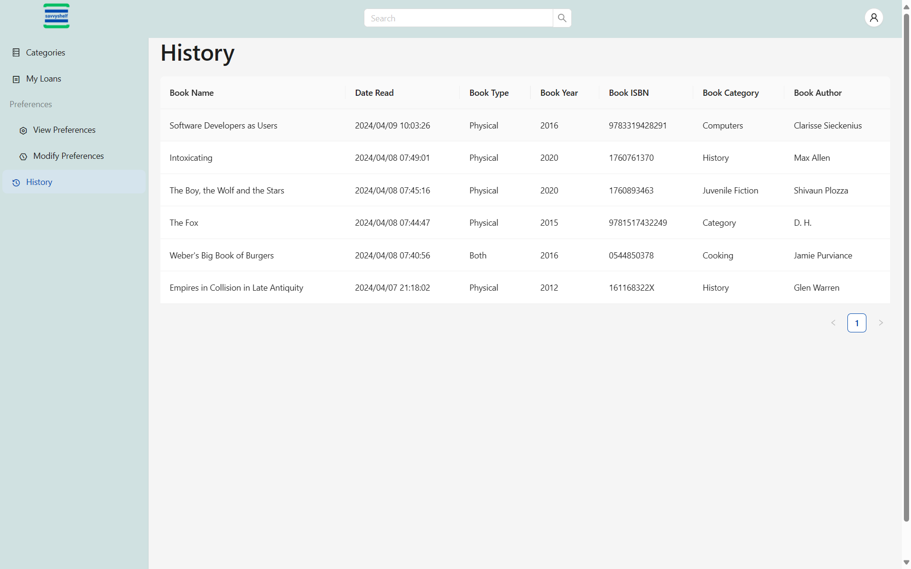
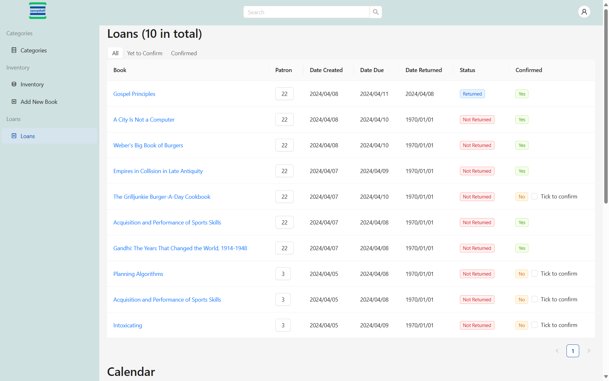
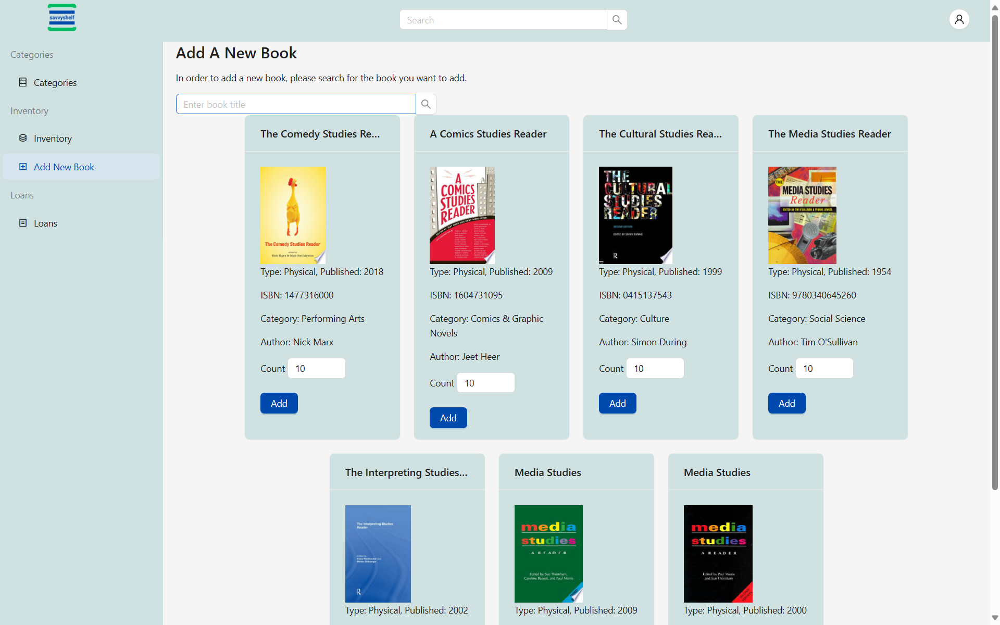
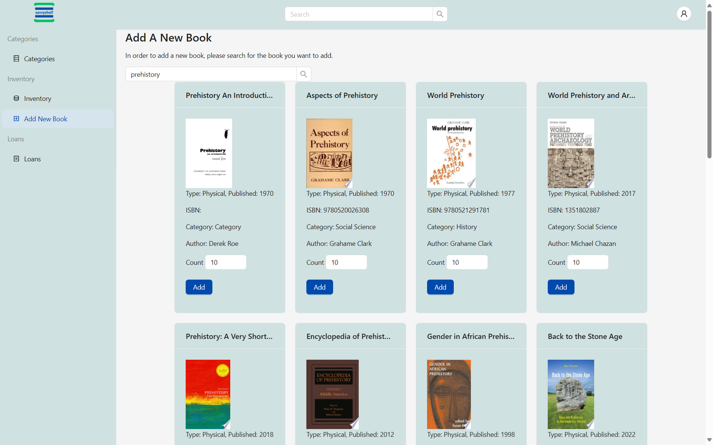
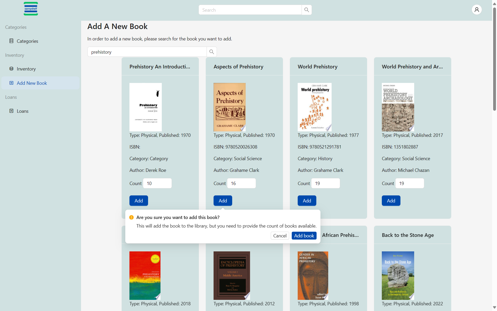
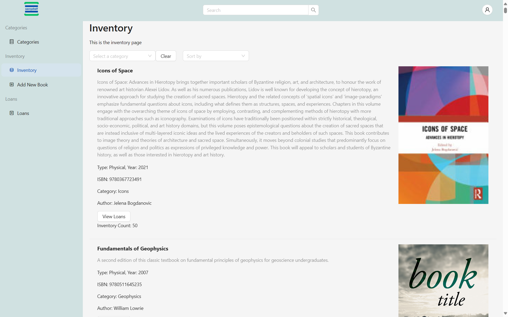

# savvyshelf

Library Management System

## Info

Project is a library management system that allows patrons to borrow books from the library. The system allows patrons to search for books, view books, borrow books, return books, and view their profile. The system also allows librarians to add books, view books, view patrons, view borrowed books, and view returned books.

## Available Scripts

In the project directory, you can run:

### `npm run dev`

Runs the app in the development mode.\
Open [http://localhost:3000](http://localhost:3000) to view it in your browser.

---

## Screenshots

  
<em>Welcome</em>

### Patron

<em>Patron Home</em>
<em>Patron cateories</em>

<em>Patron profile</em>
  <em>Patron preferences</em>

<em>Patron modify preferences</em>

<em>Patron history</em>

### Admin

<em>Admin Home</em>
<em>Admin cateories</em>

<em>Admin profile</em>
  <em>Admin loans 1</em>

  <em>Admin loans 2</em>
  <em>Admin loans interaction</em>

<em>Admin add book 1</em>

<em>Admin add book 2</em>

<em>Admin add book 3</em>

<em>Admin inventory</em>  

---

Github: @teboho/lms
&copy; 2024 teboho  